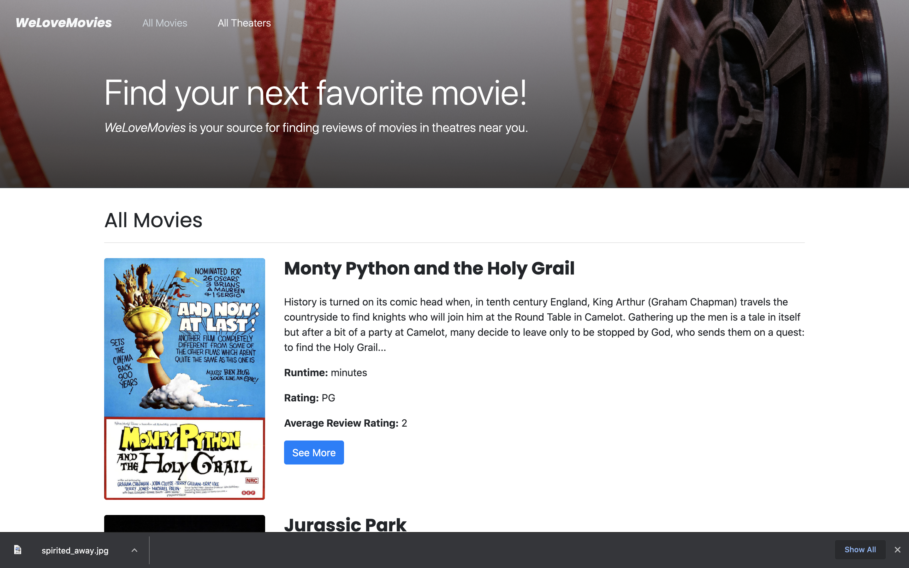
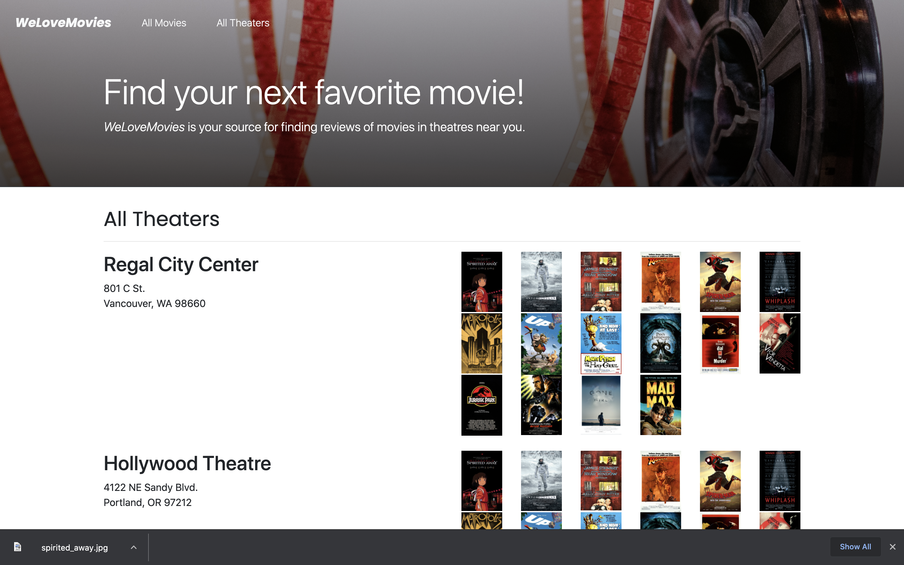
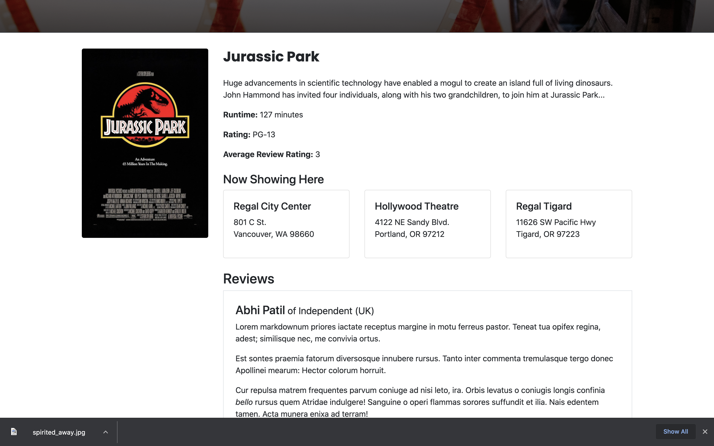
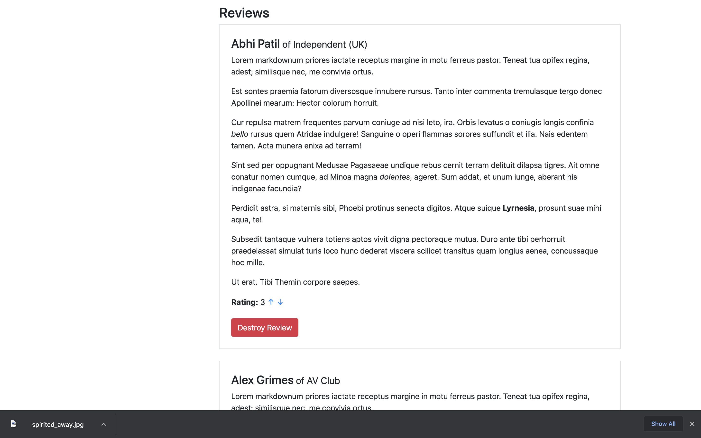

## Learning Objectives

This project was designed to test my ability to build complex servers and access data through a database. The following skills were required to complete this project:

- Install and use common middleware packages
- Receive requests through routes
- Run tests from the command line
- Access relevant information through route and query parameters
- Create an error handler for the case where a route doesn't exist
- Build an API following RESTful design principles
- Create and customize a knexfile.js file
- Create a connection to your database with Knex
- Write database queries to complete CRUD routes in an Express server
- Return joined and nested data with Knex
- Write database migrations using Knex's migration tool
- Deploy your backend server to a cloud service

## Built With

- Express
- Node.js
- React
- Knex
- PostgreSQL
- CORS
- DBeaver
- Postman
- Bootstrap

## Deployment

- [We Love Movies App](https://we-love-movies-site.netlify.app/)

- [Server Repo](https://github.com/derrickholleman/WeLoveMovies-server/)

## Screenshots

